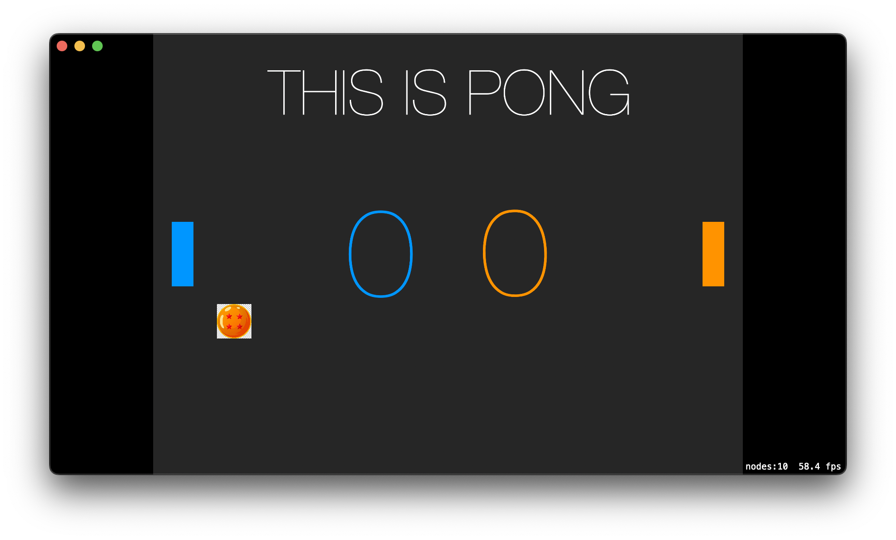

# SwiftPong

A basic Pong game written with `SpriteKit` by [@theOtherMichael](https://www.github.com/theOtherMichael) and I for <https://swift24.dev/>'s March event. It's my first foray into game dev, and Michael's first time working in Swift.

We're not including any runnable app files, but you should be able to open it in Xcode and just run it on your Mac (minimum macOS 12.0).

It's controllable via keyboard: P1 (left) is `W`/`S` and P2 (right) is `Up`/`Down` (arrow keys).

Enjoy!
